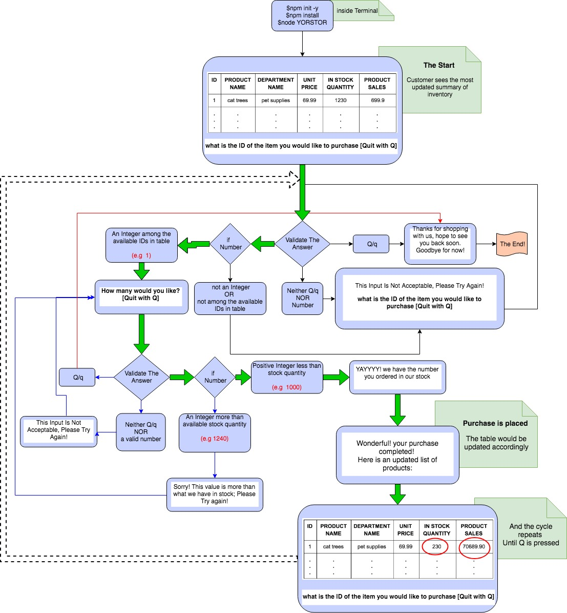

<!-- Put the name of the project after the # -->
<!-- the # means h1  -->
# YORSTORE!

<!-- Put a description of what the project is -->


This fun project is my second project in the beautiful land of node.js, the powerful package that enables us to run javascript outside of browsers. The app is called "YORSTORE" and serves both ends of a ratil store ; "the costumer" and the "store managers", providing different features to meet their specific needs. 
# Link to deployed site
<!-- make a link to the deployed site --> 
<!-- [What the user will see](the link to the deployed site) -->
[YORSTOR](https://nasibnia.github.io/Bamazon/.)

# Images
<!-- take a picture of the image and add it into the readme  -->
<!--  -->


## Where to start?

YORSTORE is a command line interface application. That means in order to run it both terminal and node.js are necessary.
Assuming both of these are installed on the machine;
- the first step toward using the application is to clone down the application from github, opening terminal and going to that directory, and install the list of dependencies (that are previously made in the json package) by typing the following comamand in terminal:

npm install 

this command will look into the json package (that is located in working directory) and automatically installs all the dependecies.
- Now YORSTORE is ready to use; to do so simply type the following command in your terminal

node YOURSTORE.js

- Sit tight and enjoy the ride; YOURSTORE guids you through the rest of journey by popping questions back and forth.

## What happens in the customer journey:

On the costumer side; YORSTORE provides the following features:

- Updated list of invetories at real time
- The chance of requesting certain amounts for shopping
- Validating the purchace request
- Updating the inventory after each purchace and providing the details to the customer
- Option to quit the shopping experience at any time!


## More details from the backend:

The customer side interface provide a table with the most recent data trakced in real time. the table has the following colomns:
* ID 
    * which is unique to any product name and in case , for whatever reason, there are two different stack labeled under the same name each of them still have a different unique id.
* Product Name
* Department Name
* Unit Price
* In Stock Quantity
* Product Sales
    * Which is an indicator of how much of revenue has been made so far from that sepecific item; the revenue is  the number of sold units * the unit price

The table would be provided for the customer review, followed by this question:

 `what is the ID of the item you would like to purchase [Quit with Q]`

- typing q/Q (The validation setting in the code is so that input is case insensititve) will prints the following on the console, ending the purchace experience:

-  ` How many would you like? [Quit with Q]`
    - If the number is bigger than current stock quantity; the customer will be warned and asked to enter a valid number. The purchase doesn't go through until then.

     `this value is more than what we have in stock` 
    `? How many would you like? [Quit with Q]`

    - Otherwise, the purchase gets complited, and customer sees the following update :
    `GREAT! your purchase completed, Here is an updated list of products:`

    and the following will be executed in the table right away
        - Purchased units will be deducted from the stock quantity. 
        - Product sales will be increased by (the number of sold units * unit price)


The following clip shows how YORSTOR works on the customer side:
It can be seen in the video, how YORSTOR validates the customer inputs and provide the appropriate follow up command afterwards;


And here is the logic flowchart in a nutshell



## What happens in the manager journey

Here is what happens in YORSTOR interface if the managers use it instead of customers;
At this point, I have not put any validation key to prove the person who's entering the manager category is actually a manager. This validation is necessary to prevent any fraud or random people messing with the inventory data. This could by checking email or employee number validation. I will add this feature soon, but as of now, here is what happens in a nutshell:

YORSTOR provides the following options to managers:

- Viewing the list of invetories at real time
- Viewing Low Inventory products
    - it is possible to enter a number and see the inventories bellow that! This process could be repeated as many times that manager wants.
- Add to Inventory 
    - Similar to customer side there is a validation process for the input; table of contents will be updated as soon as the inventory is updated
- Add New Product 
    - To add a new product, manager should enter the name, quantities, price and the department for that product. A list of already existing departments will be provided for the ease of customer. Although an additional option of "others" is also provided. If this option is selected YORSTOR will requests to provide the name of that department; 
        - if it is already among the existing ones; YORSTOR will warn the manager and list the product under the existing one,
        - Otherwise, it creates a new department with the provided name and starting sold number of 0.
- Quit the process at any point 

The following clip shows the process as well.


## Did somebody called SQL?
Yes, That's right. All this is possible thanks to SQL and MYSQL, to store, interact, and manipulate data in real time.


# technology used
<!-- make a list of technology used -->
<!-- what you used for this web app, like html css -->

<!-- 
1. First ordered list item
2. Another item
⋅⋅* Unordered sub-list. 
1. Actual numbers don't matter, just that it's a number
⋅⋅1. Ordered sub-list
4. And another item. 
-->
- javascript
- node.js
- mySQL
- promise functions
- call backs
- error handling
- inquirer (.prompt)
- npm
- node modulus


# code snippets
<!-- put snippets of code inside ``` ``` so it will look like code -->
<!-- if you want to put blockquotes use a > -->

This block of code belongs to yorStor.js where the two pointers to the instances of Customer and Manager are imported. It also brings in the inquirer to interact with the user through terminal, and call the manager.manage() or customer.shop() function based on users response.

```
var Customer = require ("./bamazonCustomer.js");
var Manager = require ("./bamazonManager.js");
var inquirer = require ("inquirer");

function start(){
    var customer = new Customer();
    var manager  = new Manager();
    inquirer.prompt([
        {
            type : "list",
            message : "Welcome to your store; Please Select one to continue",
            choices : [ "I am a customer!", "I am a Manager in this store!"],
            name : "character"

        }
        ]).then(function(response){
            switch (response.character){
                case "I am a Manager in this store!":
                    manager.manage();
                    break;
                case "I am a customer!":
                    customer.shop();
                    break;
            }
    });

}
```
This part of the code belongs to bamazonCustomer.js and starts by defining the Customer constructor containing the connection pointer to the mysql.createConnection instance. This will create a connection to the bamazon database.
Other methods are then added using the prototype. 

The second block shows the shop method wherein the connection is actually made, and while we are inside the connection another function review is called that shows data in the terminal.

The third block of the code shown in bellow is to validate the input item_id provided by customer and take appropriate actions based on the outcome of validation

```
var Customer = function(){
    this.connection = mysql.createConnection({
        host : "localhost",
        port : "3306",
    
        user : "root",
    
        password : "******",
        database : "bamazon"
    });   
}; 

Customer.prototype.shop = function () {
    this.connection.connect((err)=>{
        if (err) throw err;
        this.review();
    });
};


Customer.prototype.validateId = function(input){
    var options = [];
    // if the input is either q or Q   
    if ((input).toLowerCase() === "q"){
        this.exit();
    }//check if the id is a number 
    else if (Number.isInteger(parseFloat(input))){

        //check if the number user entered exists in the list of item options  
        var querySrt = "SELECT  item_id FROM products" ;
        this.connection.query(querySrt , (err, data) => {
            if (err) throw err;
            
            for(var i = 0; i < data.length ; i++){
                options.push(parseInt(data[i].item_id));
            }
            if(options.includes(parseInt(input))) {
                this.takeOrder(parseInt(input));        
            } else{
                console.log(chalk.cyan.bold('**********************************************************\n')+
                                chalk.bgYellow("               This value is not allowed                  \n")+
                                chalk.bgYellow(" It is either negative or bigger than max ID in our table \n")+
                                chalk.bgYellow("                   Please Try Again                       \n")+ 
                            chalk.cyan.bold('**********************************************************'));
                
                this.manageProduct();
            }
        });
    } // if the input is any other than Q or a number  
    else {
        console.log(chalk.cyan.bold('**********************************************************\n')+
                        chalk.bgYellow("      This Input Is Not Acceptable, Please Try Again      \n")+ 
                    chalk.cyan.bold('**********************************************************'));

        this.manageProduct();

    }
};
``` 


# Learning points
<!-- Learning points where you would write what you thought was helpful -->
- javascript
- node.js
- mySQL
- promise functions
- call backs
- error handling
- inquirer (.prompt)
- npm
- node modulus


# Author 
<!-- make a link to the deployed site and have your name as the link -->
Nasibeh Nourbakhshnia
(www.linkedin.com/in/nasibehnourbakhshnia)

# License
